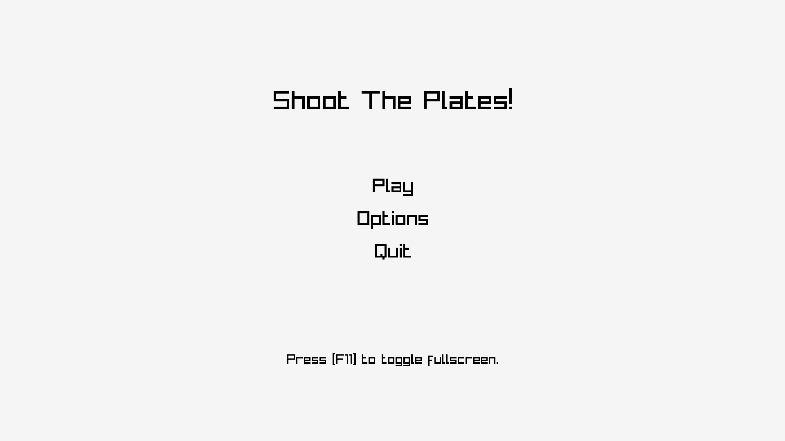
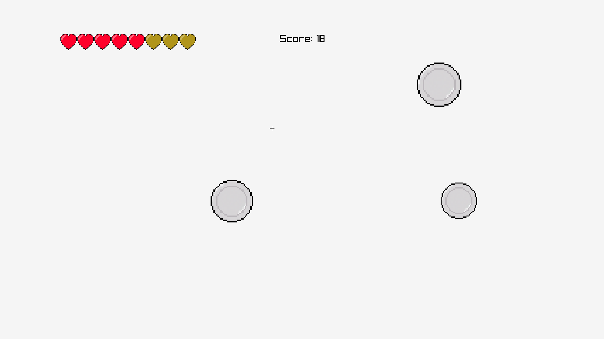

# Shoot the Plates

### 
**Shoot the Plates** is a simple game of clicking into plates to shoot and break them.
 
 

<i>Menu screen</i>

### 
Everytime the *player* breaks a plate, they will earn a **point** for it. But if the *player* fails to do so, they will loose HP.

 

<i>Game screen</i>

### 
The objective of the game is to break as much plates as possible, without letting them fall.

 

<i>Winning screen</i>

### 
If you can't do that, you will loose.

 

<i>Lost screen</i>

### <i>PS: The screenshots of the game are temporarily without any sprites, as that is the state of the game in the moment.</i>